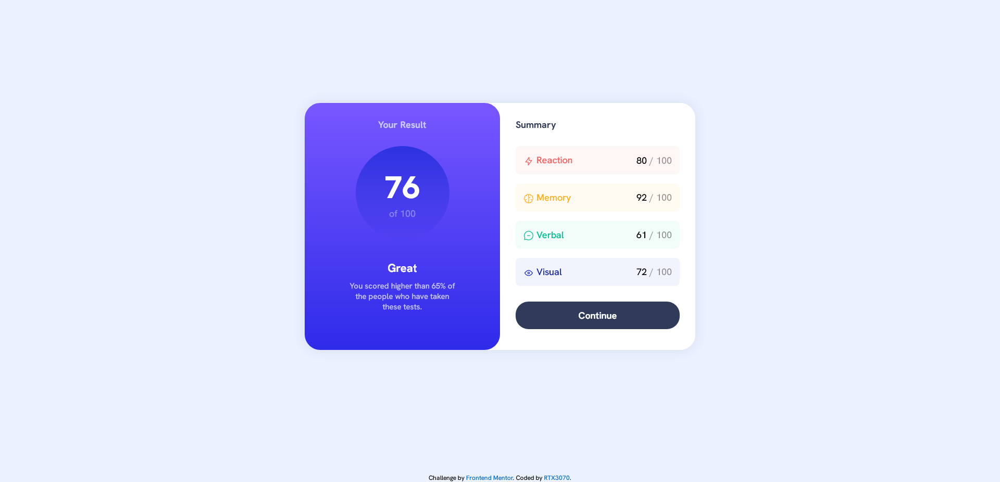
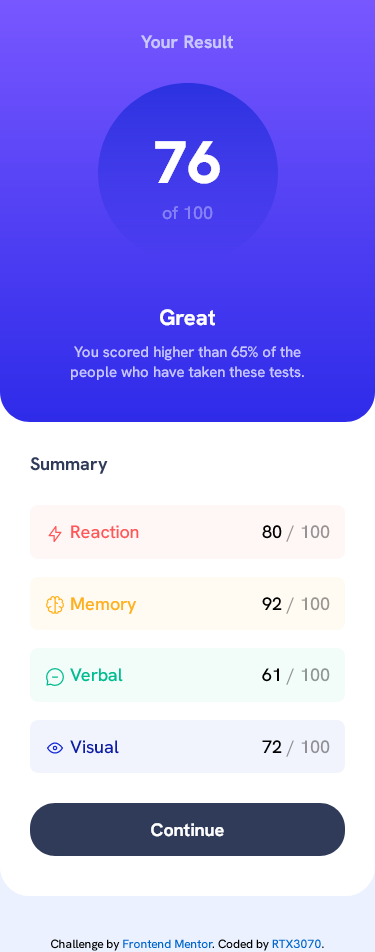

# Frontend Mentor - Results summary component solution

This is a solution to the [Results summary component challenge on Frontend Mentor](https://www.frontendmentor.io/challenges/results-summary-component-CE_K6s0maV). Frontend Mentor challenges help you improve your coding skills by building realistic projects. 

## Table of contents

- [Overview](#overview)
  - [The challenge](#the-challenge)
  - [Screenshot](#screenshot)
  - [Links](#links)
- [My process](#my-process)
  - [Built with](#built-with)
  - [What I learned](#what-i-learned)
  - [Continued development](#continued-development)
  - [Useful resources](#useful-resources)
- [Author](#author)
- [Acknowledgments](#acknowledgments)

**Note: Delete this note and update the table of contents based on what sections you keep.**

## Overview

### The challenge

Users should be able to:

- View the optimal layout for the interface depending on their device's screen size
- See hover and focus states for all interactive elements on the page

### Screenshot

### Links

- Solution URL: [https://github.com/RTX3070/frontendmentor-results-summary-component-main](https://github.com/RTX3070/frontendmentor-results-summary-component-main)
- Live Site URL: [https://rtx3070.github.io/frontendmentor-results-summary-component-main/](https://rtx3070.github.io/frontendmentor-results-summary-component-main/)

## My process

### Built with

- Semantic HTML5 markup
- CSS

## Author

- GitHub - [@RTX3070](https://github.com/RTX3070)
- Frontend Mentor - [@RTX3070](https://www.frontendmentor.io/profile/RTX3070)
- CodePen - [@rtx3070](https://codepen.io/rtx3070)
